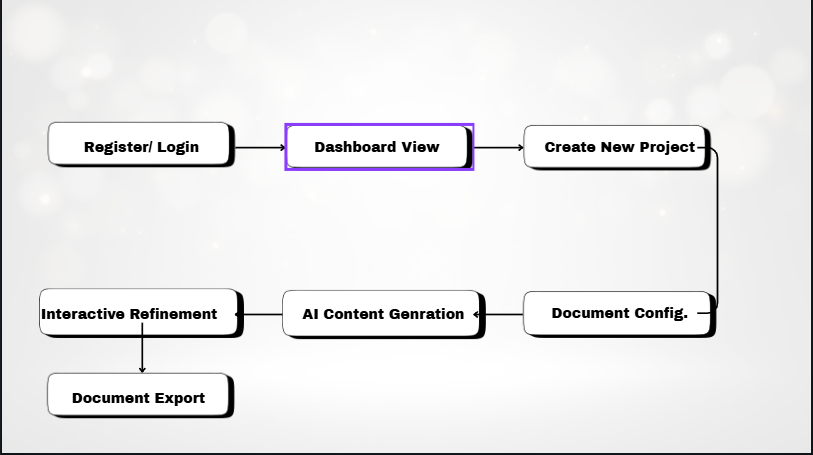
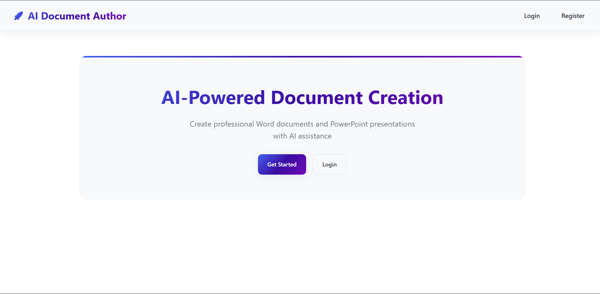
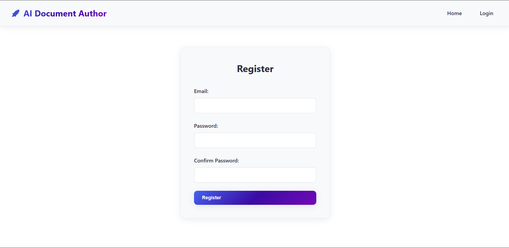
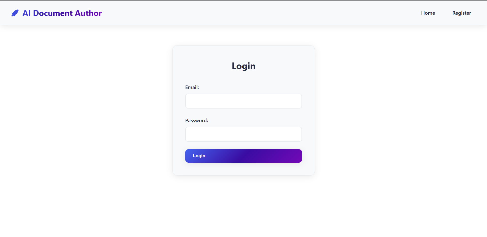
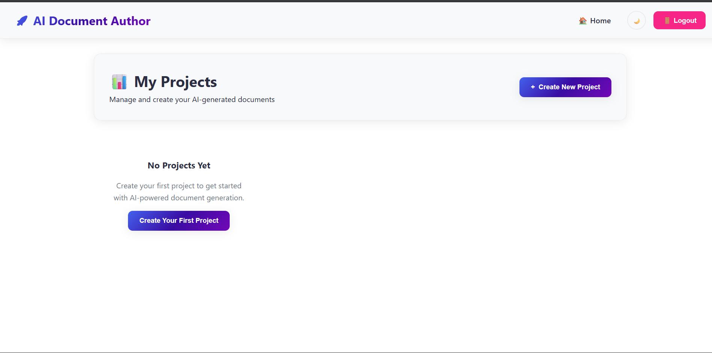
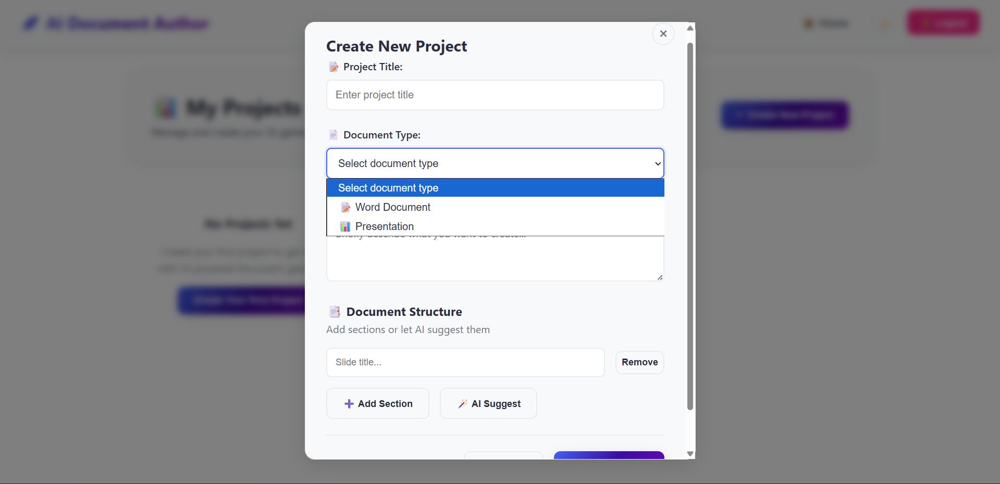
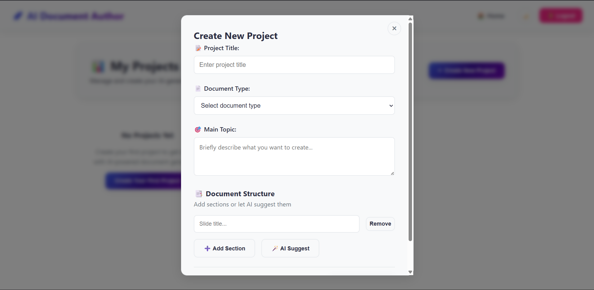
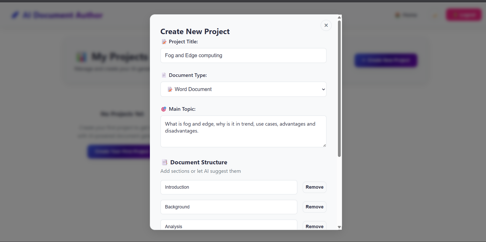
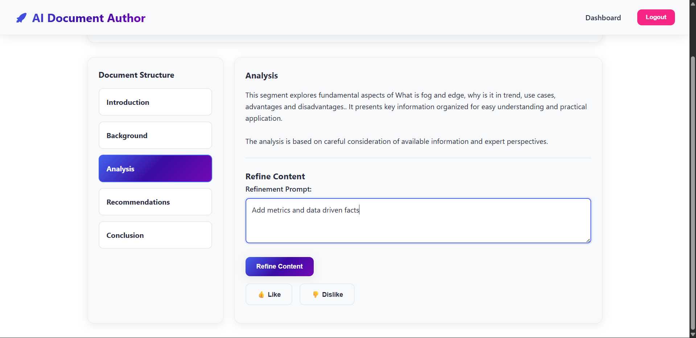
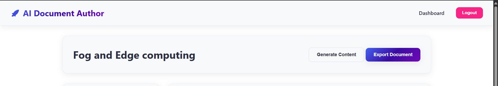

# AI-Assisted Document Authoring and Generation Platform

A full-stack web application that leverages AI to help users generate, refine, and export professional business documents in Microsoft Word (.docx) and PowerPoint (.pptx) formats.

## Table of Contents

- [Overview](#overview)
- [Features](#features)
- [Architecture](#architecture)
- [Technology Stack](#technology-stack)
- [Prerequisites](#prerequisites)
- [Installation & Setup](#installation--setup)
- [Environment Variables](#environment-variables)
- [Running the Application](#running-the-application)
- [Usage Guide](#usage-guide)
- [API Documentation](#api-documentation)
- [Database Schema](#database-schema)
- [Project Structure](#project-structure)
- [Testing](#testing)
- [Deployment](#deployment)
- [Contributing](#contributing)
- [License](#license)

## Overview

This AI-powered platform streamlines the document creation process by allowing users to:

- Select document type (Word or PowerPoint)
- Define document structure and outline
- Generate content using Google's Gemini API
- Iteratively refine content through an interactive interface
- Export polished documents in professional formats

The application provides an intuitive workflow:


## Features

### Core Features

- **User Authentication & Authorization**

  - Secure user registration and login
  - JWT-based authentication system
  - Session management

- **Project Management Dashboard**

  - View all existing projects
  - Create new projects
  - Track project status and history

- **Document Configuration**

  - Choose between Word (.docx) and PowerPoint (.pptx) formats
  - Define main topic/prompt for document
  - Create custom outlines for Word documents
  - Specify slide count and titles for PowerPoint presentations

- **AI-Powered Content Generation**

  - Section-by-section content generation using Gemini API
  - Context-aware LLM prompts
  - Intelligent content structuring

- **Interactive Refinement Interface**

  - Per-section/slide AI refinement prompts
  - Like/Dislike feedback buttons
  - Comment system for user notes
  - Real-time content updates
  - Revision history tracking

- **Professional Document Export**
  - High-quality .docx file generation
  - Professional .pptx presentation creation
  - Proper formatting and styling

### Bonus Features

- **AI-Generated Templates** (Optional)
  - AI-suggested document outlines
  - Automatic section header generation for Word
  - Automatic slide title generation for PowerPoint
  - User editing and approval workflow

## Architecture

### System Architecture Diagram

[PLACEHOLDER: Insert architecture diagram showing the following components:

- Frontend (React/HTML/CSS/JS)
- Backend (FastAPI/Flask)
- Database (SQLite)
- Gemini API Integration
- Document Generation Layer]


### Application Flow



## 🛠️ Technology Stack

### Backend

- **Framework**: FastAPI (Python 3.9+)
- **AI Integration**: Google Gemini API
- **Database**: SQLite
- **Document Generation**:
  - python-docx (Word documents)
  - python-pptx (PowerPoint presentations)
- **Authentication**: JWT (JSON Web Tokens)

### Frontend

- **Core**: HTML5, CSS3, JavaScript (ES6+)
- **Styling**: Custom CSS
- **HTTP Client**: Fetch API

### Database

- **SQLite**: Lightweight, file-based relational database
- **Storage**: documents.db

## 📦 Prerequisites

Before installation, ensure you have the following installed:

- **Python**: 3.9 or higher
- **pip**: Python package manager
- **Git**: Version control
- **Google Gemini API Key**: [Get your API key here](https://makersuite.google.com/app/apikey)

## 🚀 Installation & Setup

### 1. Clone the Repository

```bash
git clone https://github.com/yourusername/ai-document-platform.git
cd ai-document-platform
```

### 2. Create Virtual Environment

```bash
# Create virtual environment
python -m venv venv

# Activate virtual environment
# On Windows:
venv\Scripts\activate
# On macOS/Linux:
source venv/bin/activate
```

### 3. Install Dependencies

```bash
pip install -r requirements.txt
```

### 4. Set Up Environment Variables

Create a `.env` file in the root directory:

```bash
touch .env
```

Add the following configuration (see [Environment Variables](#environment-variables) section for details):

```env
GEMINI_API_KEY=your_gemini_api_key_here
SECRET_KEY=your_secret_key_here
DATABASE_URL=sqlite:///./instance/documents.db
```

### 5. Initialize Database

```bash
python -c "from app import app; from models import db; app.app_context().push(); db.create_all()"
```

## 🔐 Environment Variables

Create a `.env` file in the root directory with the following variables:

| Variable                      | Description                                     | Required | Example                             |
| ----------------------------- | ----------------------------------------------- | -------- | ----------------------------------- |
| `GEMINI_API_KEY`              | Google Gemini API key for AI content generation | Yes      | `AIzaSyD...`                        |
| `SECRET_KEY`                  | Secret key for JWT token encoding               | Yes      | `your-secret-key-min-32-chars`      |
| `DATABASE_URL`                | Database connection string                      | No       | `sqlite:///./instance/documents.db` |
| `JWT_ALGORITHM`               | Algorithm for JWT encoding                      | No       | `HS256` (default)                   |
| `ACCESS_TOKEN_EXPIRE_MINUTES` | JWT token expiration time                       | No       | `1440` (default: 24 hours)          |

### Generating a Secure Secret Key

```bash
python -c "import secrets; print(secrets.token_urlsafe(32))"
```

### Obtaining Gemini API Key

1. Visit [Google AI Studio](https://makersuite.google.com/app/apikey)
2. Sign in with your Google account
3. Click "Create API Key"
4. Copy the generated key to your `.env` file

## 💻 Running the Application

### Start the Backend Server

```bash
# Make sure virtual environment is activated
python app.py
```

The backend server will start at `http://localhost:5000`

### Access the Frontend

Open your web browser and navigate to:

```
http://localhost:5000
```

### Development Mode

For development with auto-reload:

```bash
uvicorn app:app --reload --host 0.0.0.0 --port 5000
```

## 📖 Usage Guide

### 1. User Registration

[PLACEHOLDER: Screenshot of registration page]




- Navigate to the registration page
- Enter username, email, and password
- Click "Register" to create your account

### 2. User Login

[PLACEHOLDER: Screenshot of login page]



- Enter your credentials
- Click "Login" to access the dashboard
- JWT token will be stored for authenticated requests

### 3. Dashboard Overview

[PLACEHOLDER: Screenshot of dashboard]



The dashboard displays:

- List of all your projects
- Project status and document type
- Options to create new projects or open existing ones

### 4. Creating a New Project

#### Step 1: Choose Document Type



Select either:

- **Microsoft Word (.docx)** - For text documents
- **Microsoft PowerPoint (.pptx)** - For presentations

#### Step 2: Define Topic

[PLACEHOLDER: Screenshot of topic input]



Enter the main topic or prompt for your document, such as:

- "Market Analysis of the EV Industry in 2025"
- "Company Quarterly Business Review Q4 2024"
- "Product Launch Strategy for Mobile App"

#### Step 3: Configure Structure

**For Word Documents:**

[PLACEHOLDER: Screenshot of Word outline configuration]



- Add section headers
- Reorder sections via drag-and-drop
- Remove unwanted sections
- Optional: Use "AI-Suggest Outline" for automated structure

**For PowerPoint Presentations:**

[PLACEHOLDER: Screenshot of PowerPoint slide configuration]


- Specify number of slides
- Define title for each slide
- Reorder slides as needed
- Optional: Use "AI-Suggest Titles" for automated suggestions

### 5. Content Generation

[PLACEHOLDER: Screenshot of content generation in progress]


- Click "Generate Content" button
- AI processes each section/slide sequentially
- Progress indicator shows generation status
- Generated content appears in real-time

### 6. Interactive Refinement

Refinement Interface


For each section/slide, you can:

**AI Refinement:**

- Enter refinement prompts like:
  - "Make this more formal"
  - "Convert to bullet points"
  - "Shorten to 100 words"
  - "Add more technical details"
- Click "Refine" to regenerate content

**Feedback:**

- Click 👍 (Like) or 👎 (Dislike) buttons
- Feedback is recorded for analytics

**Comments:**

- Add personal notes or reminders
- Comments are saved with the project

### 7. Document Export

[PLACEHOLDER: Screenshot of export options]



- Review all refined content
- Click "Export Document" button
- Download generated .docx or .pptx file
- File includes all refinements and proper formatting

### Example Workflows

#### Example 1: Creating a Business Report

```
1. Login → Dashboard
2. Create New Project → Word Document
3. Topic: "Annual Financial Report 2024"
4. Outline:
   - Executive Summary
   - Revenue Analysis
   - Expense Breakdown
   - Future Projections
   - Conclusion
5. Generate Content
6. Refine sections:
   - "Make Executive Summary more concise"
   - "Add specific numbers to Revenue Analysis"
7. Export .docx file
```

#### Example 2: Creating a Presentation

```
1. Login → Dashboard
2. Create New Project → PowerPoint
3. Topic: "Q4 Product Launch Strategy"
4. Slides (5):
   - Introduction
   - Market Opportunity
   - Product Features
   - Go-to-Market Strategy
   - Timeline & Budget
5. Generate Content
6. Refine slides:
   - "Make Market Opportunity more data-driven"
   - "Convert Product Features to bullet points"
7. Export .pptx file
```

## 📡 API Documentation

### Authentication Endpoints

#### Register User

```http
POST /api/register
Content-Type: application/json

{
  "username": "string",
  "email": "string",
  "password": "string"
}

Response: 201 Created
{
  "message": "User registered successfully",
  "user_id": "integer"
}
```

#### Login

```http
POST /api/login
Content-Type: application/json

{
  "username": "string",
  "password": "string"
}

Response: 200 OK
{
  "access_token": "string",
  "token_type": "bearer"
}
```

### Project Endpoints

#### Get All Projects

```http
GET /api/projects
Authorization: Bearer {token}

Response: 200 OK
[
  {
    "id": "integer",
    "title": "string",
    "doc_type": "string",
    "status": "string",
    "created_at": "datetime",
    "updated_at": "datetime"
  }
]
```

#### Create Project

```http
POST /api/projects
Authorization: Bearer {token}
Content-Type: application/json

{
  "title": "string",
  "doc_type": "docx|pptx",
  "topic": "string",
  "outline": ["string"] // For docx
  // OR
  "slides": [{"title": "string"}] // For pptx
}

Response: 201 Created
{
  "project_id": "integer",
  "message": "Project created successfully"
}
```

#### Get Project Details

```http
GET /api/projects/{project_id}
Authorization: Bearer {token}

Response: 200 OK
{
  "id": "integer",
  "title": "string",
  "doc_type": "string",
  "topic": "string",
  "sections": [...],
  "status": "string"
}
```

### Content Generation Endpoints

#### Generate Content

```http
POST /api/projects/{project_id}/generate
Authorization: Bearer {token}

Response: 200 OK
{
  "message": "Content generated successfully",
  "sections": [...]
}
```

#### Refine Section

```http
POST /api/projects/{project_id}/sections/{section_id}/refine
Authorization: Bearer {token}
Content-Type: application/json

{
  "prompt": "string"
}

Response: 200 OK
{
  "refined_content": "string",
  "section_id": "integer"
}
```

#### Submit Feedback

```http
POST /api/projects/{project_id}/sections/{section_id}/feedback
Authorization: Bearer {token}
Content-Type: application/json

{
  "feedback_type": "like|dislike",
  "comment": "string" // Optional
}

Response: 200 OK
{
  "message": "Feedback recorded"
}
```

### Export Endpoints

#### Export Document

```http
GET /api/projects/{project_id}/export
Authorization: Bearer {token}

Response: 200 OK
Content-Type: application/vnd.openxmlformats-officedocument.wordprocessingml.document
// OR
Content-Type: application/vnd.openxmlformats-officedocument.presentationml.presentation

Binary file data
```

### AI Template Generation (Bonus)

#### Generate Outline Suggestions

```http
POST /api/ai-suggest-outline
Authorization: Bearer {token}
Content-Type: application/json

{
  "topic": "string",
  "doc_type": "docx|pptx"
}

Response: 200 OK
{
  "suggestions": ["string"] // For docx
  // OR
  "suggestions": [{"title": "string"}] // For pptx
}
```

## 🗄️ Database Schema

### Users Table

```sql
CREATE TABLE users (
    id INTEGER PRIMARY KEY AUTOINCREMENT,
    username VARCHAR(80) UNIQUE NOT NULL,
    email VARCHAR(120) UNIQUE NOT NULL,
    password_hash VARCHAR(255) NOT NULL,
    created_at DATETIME DEFAULT CURRENT_TIMESTAMP
);
```

### Projects Table

```sql
CREATE TABLE projects (
    id INTEGER PRIMARY KEY AUTOINCREMENT,
    user_id INTEGER NOT NULL,
    title VARCHAR(200) NOT NULL,
    doc_type VARCHAR(10) NOT NULL, -- 'docx' or 'pptx'
    topic TEXT NOT NULL,
    status VARCHAR(20) DEFAULT 'draft',
    created_at DATETIME DEFAULT CURRENT_TIMESTAMP,
    updated_at DATETIME DEFAULT CURRENT_TIMESTAMP,
    FOREIGN KEY (user_id) REFERENCES users (id)
);
```

### Sections Table

```sql
CREATE TABLE sections (
    id INTEGER PRIMARY KEY AUTOINCREMENT,
    project_id INTEGER NOT NULL,
    title VARCHAR(200) NOT NULL,
    content TEXT,
    order_index INTEGER NOT NULL,
    created_at DATETIME DEFAULT CURRENT_TIMESTAMP,
    updated_at DATETIME DEFAULT CURRENT_TIMESTAMP,
    FOREIGN KEY (project_id) REFERENCES projects (id)
);
```

### Refinements Table

```sql
CREATE TABLE refinements (
    id INTEGER PRIMARY KEY AUTOINCREMENT,
    section_id INTEGER NOT NULL,
    prompt TEXT NOT NULL,
    refined_content TEXT NOT NULL,
    created_at DATETIME DEFAULT CURRENT_TIMESTAMP,
    FOREIGN KEY (section_id) REFERENCES sections (id)
);
```

### Feedback Table

```sql
CREATE TABLE feedback (
    id INTEGER PRIMARY KEY AUTOINCREMENT,
    section_id INTEGER NOT NULL,
    feedback_type VARCHAR(10) NOT NULL, -- 'like' or 'dislike'
    comment TEXT,
    created_at DATETIME DEFAULT CURRENT_TIMESTAMP,
    FOREIGN KEY (section_id) REFERENCES sections (id)
);
```

### Entity Relationship Diagram

[PLACEHOLDER: Insert ER diagram]


## 📁 Project Structure

```
ai-document-platform/
├── instance/
│   └── documents.db           # SQLite database file
├── static/
│   └── css/
│       └── style.css          # Global styles
├── templates/
│   ├── dashboard.html         # User dashboard
│   ├── editor.html           # Document editor interface
│   ├── index.html            # Landing page
│   ├── login.html            # Login page
│   └── register.html         # Registration page
├── __pycache__/              # Python cache files
├── .gitignore                # Git ignore rules
├── app.py                    # Main FastAPI application
├── document_generator.py     # Document assembly logic
├── gemini_client.py          # Gemini API integration
├── models.py                 # Database models
├── requirements.txt          # Python dependencies
├── .env                      # Environment variables (not in repo)
└── README.md                 # This file
```

### Key Files Description

- **app.py**: Main application entry point with API routes
- **models.py**: SQLAlchemy database models and schema
- **gemini_client.py**: Wrapper for Gemini API calls
- **document_generator.py**: Logic for .docx and .pptx file generation
- **templates/**: HTML templates for frontend pages
- **static/css/**: Styling and responsive design
- **instance/**: Database and instance-specific files

## 🧪 Testing

### Running Tests

```bash
# Install testing dependencies
pip install pytest pytest-cov

# Run all tests
pytest

# Run with coverage report
pytest --cov=. --cov-report=html

# Run specific test file
pytest tests/test_auth.py
```

### Manual Testing Checklist

- [✅] User registration with validation
- [✅] User login and JWT token generation
- [✅] Dashboard displays projects correctly
- [✅] Create Word document project
- [✅] Create PowerPoint project
- [✅] AI content generation for all sections
- [✅] Section refinement with AI prompts
- [✅] Like/Dislike feedback recording
- [✅] Comments added and persisted
- [✅] Export .docx file with proper formatting
- [✅] Export .pptx file with proper formatting
- [✅] AI-generated outline suggestions (bonus)
- [✅] Logout and session management

## 🚢 Deployment

Render URL
https://ai-document-generator-vhvm.onrender.com/editor?project_id=1

### Local Deployment

The application is configured for local deployment by default. Follow the [Running the Application](#running-the-application) section.

#### Using Docker

```dockerfile
# Dockerfile
FROM python:3.9-slim

WORKDIR /app

COPY requirements.txt .
RUN pip install --no-cache-dir -r requirements.txt

COPY . .

EXPOSE 5000

CMD ["uvicorn", "app:app", "--host", "0.0.0.0", "--port", "5000"]
```

```bash
# Build and run
docker build -t ai-doc-platform .
docker run -p 5000:5000 --env-file .env ai-doc-platform
```

#### Deployment Platforms

**Recommended platforms:**

- **Railway**: Easy Python deployment
- **Render**: Free tier available
- **Heroku**: Simple deployment with add-ons
- **AWS EC2**: Full control and scalability
- **Google Cloud Run**: Serverless container deployment

### Environment Configuration

For production, ensure:

- Strong `SECRET_KEY` (32+ characters)
- HTTPS enabled
- CORS properly configured
- Rate limiting implemented
- Database backups scheduled

## 🤝 Contributing

Contributions are welcome! Please follow these guidelines:

1. Fork the repository
2. Create a feature branch (`git checkout -b feature/AmazingFeature`)
3. Commit your changes (`git commit -m 'Add some AmazingFeature'`)
4. Push to the branch (`git push origin feature/AmazingFeature`)
5. Open a Pull Request

### Code Style

- Follow PEP 8 for Python code
- Use meaningful variable and function names
- Add docstrings to functions and classes
- Comment complex logic

## 📄 License

This project is licensed under the MIT License - see the [LICENSE](LICENSE) file for details.

## 🙏 Acknowledgments

- Google Gemini API for AI capabilities
- python-docx and python-pptx libraries
- FastAPI framework
- The open-source community

## 📞 Support

For issues, questions, or suggestions:

- Open an issue on GitHub
- Email: support@example.com
- Documentation: [Wiki](https://github.com/yourusername/ai-document-platform/wiki)

## 📊 Project Status

Current Version: 1.0.0

**Status**: ✅ Production Ready

**Recent Updates**:

- Initial release with core features
- AI-powered content generation
- Document export functionality
- User authentication system

**Built with ❤️ using FastAPI, Gemini AI, and modern web technologies**
